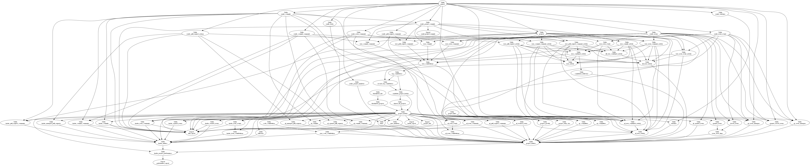
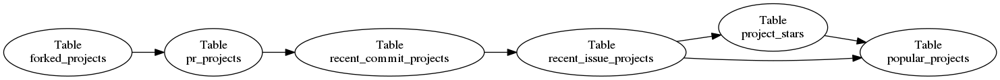

<!-- vim: fileencoding=utf-8
-->
## Real-world queries can be complex


(2600 lines of SQL)

---
## Real-world queries can be expensive
```
Jan 21 12:22 user_pull_request_activity
Jan 21 12:58 user_combined_activity
[29 lines removed]
Jan 21 14:40 new_members
Jan 21 14:40 nl_commit_comments
Jan 21 17:56 nl_commits
Jan 21 20:52 nl_issue_comments
[10 lines removed]
Jan 21 21:49 nl_pull_request_comments
Jan 22 00:08 nl_user_combined_activity
[12 lines removed]
Jan 22 02:04 leader_project_performance
Jan 22 02:05 lines_per_commit
```

---
## What can we do?
* Modularize
  * Incremental construction
  * Unit testing
  * Execution checkpoints
  * Reuse

---
## Approaches
* Oracle/DB2/PostgreSQL/... materialized views
* Justin Swanhart's MySQL [Flexviews](https://github.com/greenlion/swanhart-tools)
* Make-based [simple-rolap](https://github.com/dspinellis/simple-rolap)

---
## Example task
1. Choose repositories that have forks (_A_)
2. from _A_, exclude repos that never received a PR (_B_)
3. from _B_, exclude repos that where inactive _recently_ (_C_)

On _C_, we can then apply further criteria (e.g. programming language,
build system, minimum number of stars etc).

---
## Environment setup
* Clone and install [github.com/dspinellis/rdbunit](https://github.com/dspinellis/rdbunit)
* Clone [github.com/dspinellis/simple-rolap](https://github.com/dspinellis/simple-rolap)

---
## Project setup
Create a `Makefile` with the following contents:
```Makefile
export RDBMS?=sqlite
export MAINDB?=rxjs-ghtorrent
export ROLAPDB?=driveby
export DEPENDENCIES=rxjs-ghtorrent.db

include ../../Makefile

rxjs-ghtorrent.db:
        wget https://github.com/ghtorrent/tutorial/raw/master/rxjs-ghtorrent.db
```

---
## Repositories with forks
Create a file `forked_projects.sql`
```sql
-- Projects that have been forked

create table driveby.forked_projects AS
  select distinct forked_from as id from projects;
```

---
## Run it
```sh
$ make
rm -f ./.depend
sh ../..//mkdep.sh >./.depend
mkdir -p tables
sh ../..//run_sql.sh forked_projects.sql >tables/forked_projects
```

---
## Run it again
```sh
$ make
make: Nothing to be done for 'all'.
```

---
## Yes, but is it correct?
Create a file `forked_projects.rdbu`
```
BEGIN SETUP

projects:
id      forked_from
1       15
2       15
3       10
4       NULL

END

INCLUDE CREATE forked_projects.sql

BEGIN RESULT
driveby.forked_projects:
id
15
10
END
```

---
## Run the tests
```
$ make test
../..//run_test.sh
not ok 1 - forked_projects.rdbu: test_driveby.forked_projects
1..1
```

Houston, we have a problem!

---
## Step-by--step debugging
```
$ rdbunit --database=sqlite forked_projects.rdbu >script.sql
$ sqlite3
SQLite version 3.8.7.1 2014-10-29 13:59:56
sqlite> .read script.sql
not ok 1 - forked_projects.rdbu: test_driveby.forked_projects
1..1

sqlite> select * from test_driveby.forked_projects;
15
10

sqlite> select count(*) from test_driveby.forked_projects;
3
```

---
## Correct the error
```sql
-- Projects that have been forked

create table driveby.forked_projects AS
  select distinct forked_from as id from projects
  where forked_from is not null;
```

---
## Test again
```
$ make test
rm -f ./.depend
sh ../..//mkdep.sh >./.depend
../..//run_test.sh
ok 1 - forked_projects.rdbu: test_driveby.forked_projects
1..1
```

Bingo!

---
## Exclude projects with no PRs
Create a file `pr_projects.sql`

```sql
-- Projects that have been forked and have a PR

create table driveby.pr_projects AS
  select distinct forked_projects.id from driveby.forked_projects
  inner join issues on issues.repo_id = forked_projects.id;
```

---
## Run it (incrementally)
```
$ make
rm -f ./.depend
sh ../..//mkdep.sh >./.depend
mkdir -p tables
sh ../..//run_sql.sh pr_projects.sql >tables/pr_projects
```

---
## Test a little
Create a file `pr_projects.rdbu`
```
# Projects that have at least one PR associated with them

BEGIN SETUP

driveby.forked_projects:
id
1
2
3
4

issues:
id      repo_id
15      1
16      1
17      4
END

INCLUDE CREATE pr_projects.sql

BEGIN RESULT
driveby.pr_projects:
id
1
4
END
```

---
## Run tests
```
$ make test
../..//run_test.sh
ok 1 - forked_projects.rdbu: test_driveby.forked_projects
1..1
ok 1 - pr_projects.rdbu: test_driveby.pr_projects
1..1
```

---
## Exclude projects with no recent commits
Create a file `recent_commit_projects.sql`

```sql
-- Projects with recent commits

create table driveby.pr_projects AS
  select distinct pr_projects.id
  from driveby.pr_projects
  left join commits
  on commits.project_id = pr_projects.id
  where created_at > '2017-01-01';
```

---
## Test a little (really now?)
Create a file `recent_commit_projects.rdbu`
```
# Projects that have a recent commit associated with them

BEGIN SETUP
driveby.pr_projects:
id
1
2
3
4

commits:
id      project_id      created_at
15      1               '2017-05-12'
16      1               '2010-01-01'
16      2               '2017-01-02'
16      2               '2017-01-03'
17      4               '1970-01-01'
END

INCLUDE CREATE recent_commit_projects.sql

BEGIN RESULT
driveby.recent_commit_projects:
id
1
2
END
```

---
## Run tests
```
$ make test
../..//run_test.sh
ok 1 - forked_projects.rdbu: test_driveby.forked_projects
1..1
ok 1 - pr_projects.rdbu: test_driveby.pr_projects
1..1
Error: near line 25: table pr_projects already exists
Error: near line 38: no such table: test_driveby.recent_commit_projects
1..1
../../Makefile:79: recipe for target 'test' failed
make: *** [test] Error 1
```
???

---
## Correct table name in query
```sql
-- Projects with recent commits

create table driveby.recent_commit_projects AS
  select distinct pr_projects.id
  from driveby.pr_projects
  left join commits
  on commits.project_id = pr_projects.id
  where created_at > '2017-01-01';
```

---
## Run tests again
```
$ make test
rm -f ./.depend
sh ../..//mkdep.sh >./.depend
../..//run_test.sh
ok 1 - forked_projects.rdbu: test_driveby.forked_projects
1..1
ok 1 - pr_projects.rdbu: test_driveby.pr_projects
1..1
ok 1 - recent_commit_projects.rdbu: test_driveby.recent_commit_projects
1..1
```

---
## Incremental build
```
$ make
mkdir -p tables
sh ../..//run_sql.sh recent_commit_projects.sql >tables/recent_commit_projects
```

---
## An aha moment
* PR means "pull request" not "problem report"
* Rewrite `pr_projects.sql`

```
-- Projects that have been forked and have a PR

create table driveby.pr_projects AS
  select distinct forked_projects.id from driveby.forked_projects
  inner join pull_requests on pull_requests.base_repo_id = forked_projects.id;
```

---
## Run make again
Notice that only dependent tables get built
```
$ make
mkdir -p tables
sh ../..//run_sql.sh pr_projects.sql >tables/pr_projects
mkdir -p tables
sh ../..//run_sql.sh recent_commit_projects.sql >tables/recent_commit_projects
```

---
## Exclude projects with no recent issues
Test and run
```
$ make test
rm -f ./.depend
sh ../..//mkdep.sh >./.depend
../..//run_test.sh
ok 1 - forked_projects.rdbu: test_driveby.forked_projects
1..1
ok 1 - pr_projects.rdbu: test_driveby.pr_projects
1..1
ok 1 - recent_commit_projects.rdbu: test_driveby.recent_commit_projects
1..1
ok 1 - recent_issue_projects.rdbu: test_driveby.recent_issue_projects
1..1
$ make
mkdir -p tables
sh ../..//run_sql.sh recent_issue_projects.sql >tables/recent_issue_projects
```

---
## Count number of project stars
Create a file `project_stars.sql`
```
-- Projects with recent issues and the number of stars

create table driveby.project_stars AS
  select recent_issue_projects.id as id, count(*) as stars
  from driveby.recent_issue_projects
  left join watchers
  on watchers.repo_id = recent_issue_projects.id
  group by recent_issue_projects.id;
```

## Corresponding test
Create a file `project_stars.rdbu`
```
# Projects with recent issues and the number of stars

BEGIN SETUP
driveby.recent_issue_projects:
id
1
2
3

watchers:
repo_id
1
1
2
END

INCLUDE CREATE project_stars.sql

BEGIN RESULT
driveby.project_stars:
id      stars
1       2
2       1
3       0
END
```

---
## Run test
```
../..//run_test.sh
ok 1 - forked_projects.rdbu: test_driveby.forked_projects
1..1
ok 1 - pr_projects.rdbu: test_driveby.pr_projects
1..1
not ok 1 - project_stars.rdbu: test_driveby.project_stars
1..1
ok 1 - recent_commit_projects.rdbu: test_driveby.recent_commit_projects
1..1
ok 1 - recent_issue_projects.rdbu: test_driveby.recent_issue_projects
1..1
```

---
## Fix query
Count only non-null rows
```
-- Projects with recent issues and the number of stars

create table driveby.project_stars AS
  select recent_issue_projects.id as id, count(watchers.repo_id) as stars
  from driveby.recent_issue_projects
  left join watchers
  on watchers.repo_id = recent_issue_projects.id
  group by recent_issue_projects.id;
```

---
## Run test again
```
$ make test
rm -f ./.depend
sh ../..//mkdep.sh >./.depend
../..//run_test.sh
ok 1 - forked_projects.rdbu: test_driveby.forked_projects
1..1
ok 1 - pr_projects.rdbu: test_driveby.pr_projects
1..1
ok 1 - project_stars.rdbu: test_driveby.project_stars
1..1
ok 1 - recent_commit_projects.rdbu: test_driveby.recent_commit_projects
1..1
ok 1 - recent_issue_projects.rdbu: test_driveby.recent_issue_projects
1..1
```

---
## Add and test popular projects
```
$ make test
../..//run_test.sh
ok 1 - forked_projects.rdbu: test_driveby.forked_projects
1..1
ok 1 - popular_projects.rdbu: test_driveby.popular_projects
1..1
ok 1 - pr_projects.rdbu: test_driveby.pr_projects
1..1
ok 1 - project_stars.rdbu: test_driveby.project_stars
1..1
ok 1 - recent_commit_projects.rdbu: test_driveby.recent_commit_projects
1..1
ok 1 - recent_issue_projects.rdbu: test_driveby.recent_issue_projects
1..1
$ make
mkdir -p tables
sh ../..//run_sql.sh project_stars.sql >tables/project_stars
mkdir -p tables
sh ../..//run_sql.sh popular_projects.sql >tables/popular_projects
```

---
## Where do we stand?
```sh
$ make graph.png
../..//dep2dot.sed .depend >graph.dot
dot -Tpng graph.dot -o graph.png
```



